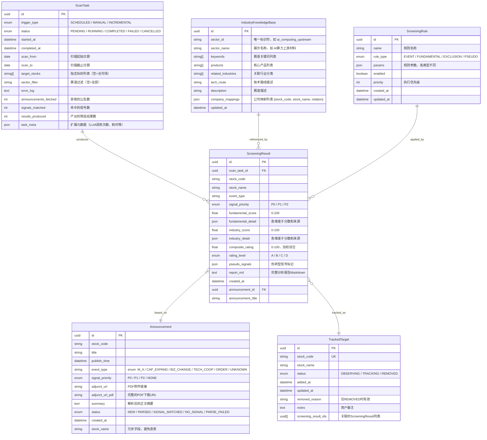

# 数据模型设计: 潜力标的智能挖掘系统

> Phase 1 output. 定义系统中所有实体（作为 JSON schema）、文件存储结构和数据约束。
>
> **设计决策**: 本系统不使用数据库，采用 JSON 文件存储。详见下方「文件存储结构」章节。

---

## 实体关系总览



---

## 实体详情（JSON Schema 定义）

所有实体以 Python dataclass 定义于 `src/potential_stock_mining/models.py`，序列化为 JSON 存入文件。

### 1. Announcement (公告记录)

```python
@dataclass
class Announcement:
    id: str                           # uuid4 字符串
    stock_code: str                   # 股票代码，如 "600519"
    stock_name: str                   # 股票名称
    title: str                        # 公告标题
    publish_time: str                 # ISO 格式时间戳 "2026-06-20T09:00:00"
    event_type: str                   # 枚举: M_A / CAP_EXPAND / BIZ_CHANGE / TECH_COOP / ORDER / OTHER / UNKNOWN
    signal_priority: str              # 枚举: P0 / P1 / P2 / NONE
    adjunct_url: Optional[str]        # PDF 附件相对路径
    adjunct_url_pdf: Optional[str]    # 完整 PDF 下载 URL
    summary: Optional[str]            # 公告正文摘要
    status: str = "NEW"              # 枚举: NEW / PARSED / SIGNAL_MATCHED / NO_SIGNAL / PARSE_FAILED
    created_at: str = ""             # ISO 时间戳，默认当前时间
```

**event_type 枚举值**:
- `M_A` — 并购重组 | `CAP_EXPAND` — 产能扩张 | `BIZ_CHANGE` — 业务变更/跨界
- `TECH_COOP` — 技术合作 | `ORDER` — 订单落地 | `OTHER` — 其他 | `UNKNOWN` — 无法识别

---

### 2. ScreeningResult (筛选结果)

```python
@dataclass
class ScreeningResult:
    id: str                           # uuid4
    scan_task_id: str                 # 关联 ScanTask.id
    announcement_id: str              # 关联 Announcement.id
    stock_code: str
    stock_name: str
    announcement_title: str
    event_type: str
    signal_priority: str              # P0 / P1 / P2
    fundamental_score: float          # 0-100
    fundamental_detail: dict          # JSON: {financial_health, governance, valuation_safety, details}
    industry_score: float             # 0-100
    industry_detail: dict             # JSON: {sector_space, biz_synergy, industry_impact, earnings_elasticity, details}
    composite_rating: float           # 0-100 加权综合
    rating_level: str                 # A (>=80) / B (>=60) / C (>=40) / D (<40)
    pseudo_signals: list              # 伪转型信号标记列表
    report_md: str                    # 完整分析报告 Markdown
    created_at: str = ""
```

**fundamental_detail 示例**:
```json
{
  "financial_health": 85, "governance": 70, "valuation_safety": 60,
  "details": {"revenue_yoy": 25.5, "gross_margin": 0.35, "roe": 0.12},
  "data_completeness": "partial"
}
```

**industry_detail 示例**:
```json
{
  "sector_space": 75, "biz_synergy": 60, "industry_impact": 55, "earnings_elasticity": 70,
  "details": {"sector_name": "AI 算力上游材料", "sector_growth_rate": 0.25}
}
```

---

### 3. TrackedTarget (跟踪标的)

```python
@dataclass
class TrackedTarget:
    id: str                           # uuid4
    stock_code: str                   # 唯一约束
    stock_name: str
    status: str = "OBSERVING"        # OBSERVING / TRACKING / REMOVED
    added_at: str = ""
    updated_at: str = ""
    removed_reason: Optional[str] = None
    notes: Optional[str] = None
    screening_result_ids: list = field(default_factory=list)
```

**status 状态机**: `OBSERVING ⇄ TRACKING → REMOVED`（REMOVED 不可逆）

---

### 4. IndustryKnowledgeBase (产业知识库)

以 YAML 文件维护（非 JSON），存放于 `config/industry_kb.yaml`。

```yaml
ai_computing_upstream:
  sector_name: "AI 算力上游材料"
  keywords: [算力, GPU, AI芯片, HBM, 光模块, 服务器, 液冷, PCB]
  products: [AI服务器, 高速光模块, HBM内存, AI芯片]
  related_industries: [电子, 计算机, 通信]
  tech_route: ""
  description: ""
  company_mappings:
    - stock_code: "600522"
      stock_name: "中天科技"
      relation: "光模块/光纤"
```

---

### 5. ScreeningRule (筛选规则)

以 YAML 文件维护，存放于 `config/screening_rules.yaml`。

```yaml
rules:
  - name: "并购重组信号"
    rule_type: "EVENT"
    params:
      event_type: "M_A"
      priority: "P0"
      include_keywords: ["收购", "并购", "重组", "借壳", "吸收合并"]
      exclude_keywords: ["出售", "转让"]
    enabled: true
    priority: 10
```

**rule_type 枚举**: `EVENT` / `FUNDAMENTAL` / `EXCLUSION` / `PSEUDO`

---

### 6. ScanTask (扫描任务)

```python
@dataclass
class ScanTask:
    id: str                           # uuid4
    trigger_type: str                 # SCHEDULED / MANUAL / INCREMENTAL
    status: str = "PENDING"          # PENDING → RUNNING → COMPLETED / FAILED / CANCELLED
    started_at: Optional[str] = None
    completed_at: Optional[str] = None
    scan_from: str = ""               # "2026-06-01"
    scan_to: str = ""
    target_stocks: Optional[list] = None   # 指定标的列表（None=全市场）
    sector_filter: Optional[str] = None
    error_log: Optional[str] = None
    announcements_fetched: int = 0
    signals_matched: int = 0
    results_produced: int = 0
    task_meta: Optional[dict] = None       # {llm_calls, duration_seconds, ...}
```

---

## 数据关系约束

1. **ScanTask → ScreeningResult**: 一对多。一次扫描产生零到多个筛选结果。
2. **Announcement → ScreeningResult**: 一对一。一条公告最多触发一个筛选结果（去重）。
3. **ScreeningResult → TrackedTarget**: 多对一。多条筛选结果可能指向同一标的，合并跟踪。
4. **同一标的去重规则**: 同一 `stock_code` 在 `[scan_from, scan_to]` 范围内已存在同类型事件时，更新而非新增。

---

## 文件存储结构

```text
data/potential_stock_minning/
├── index.json                       # 汇总索引（内存加载，快速查询）
├── tasks/
│   ├── 2026-06-20_scheduled.json    # 每次扫描一个文件
│   └── 2026-06-20_manual.json
├── results/
│   ├── 2026/
│   │   └── 06/
│   │       ├── {result_id}.json     # 每条筛选结果一个文件
│   │       └── ...
│   └── index.json                   # 按月份组织的结果索引
└── targets.json                     # 跟踪标的清单（单一文件，量小）
```

### 存储管理类 `MiningFileStore`

```python
# src/potential_stock_mining/file_store.py

class MiningFileStore:
    """纯文件化存储引擎，替代数据库/SQLAlchemy"""

    DATA_DIR = "data/potential_stock_mining"

    # --- 筛选结果 ---
    def save_result(self, result: ScreeningResult) -> str: ...
    def get_result(self, result_id: str) -> Optional[ScreeningResult]: ...
    def list_results(self, since: str = "", until: str = "",
                     event_type: str = "", rating_level: str = "",
                     stock_code: str = "", page: int = 1, page_size: int = 20
                     ) -> tuple[list[ScreeningResult], int]: ...
    def delete_result(self, result_id: str) -> bool: ...

    # --- 扫描任务 ---
    def save_task(self, task: ScanTask) -> str: ...
    def get_task(self, task_id: str) -> Optional[ScanTask]: ...
    def list_tasks(self, limit: int = 20) -> list[ScanTask]: ...

    # --- 跟踪标的 ---
    def get_all_targets(self) -> list[TrackedTarget]: ...
    def get_target(self, stock_code: str) -> Optional[TrackedTarget]: ...
    def save_target(self, target: TrackedTarget) -> str: ...
    def update_target_status(self, stock_code: str, status: str, reason: str = "") -> bool: ...

    # --- 内部方法 ---
    def _rebuild_index(self) -> None: ...       # 重建 results/index.json
    def _load_index(self) -> dict: ...           # 加载月份级索引
    def _result_path(self, result_id: str, date: str) -> Path: ...
```

### 查询性能说明

- **按日期筛选**: 通过目录结构 `results/2026/06/` 定位，扫描该月 JSON 文件
- **按 stock_code 筛选**: 通过 `index.json` 的内存映射快速定位
- **全量数据量**: 月均 50-200 条结果，单个 JSON 文件 ~5KB，全量加载到内存无压力
- **索引重建**: 当文件手动删除或搬迁后，调用 `_rebuild_index()` 重新生成索引

